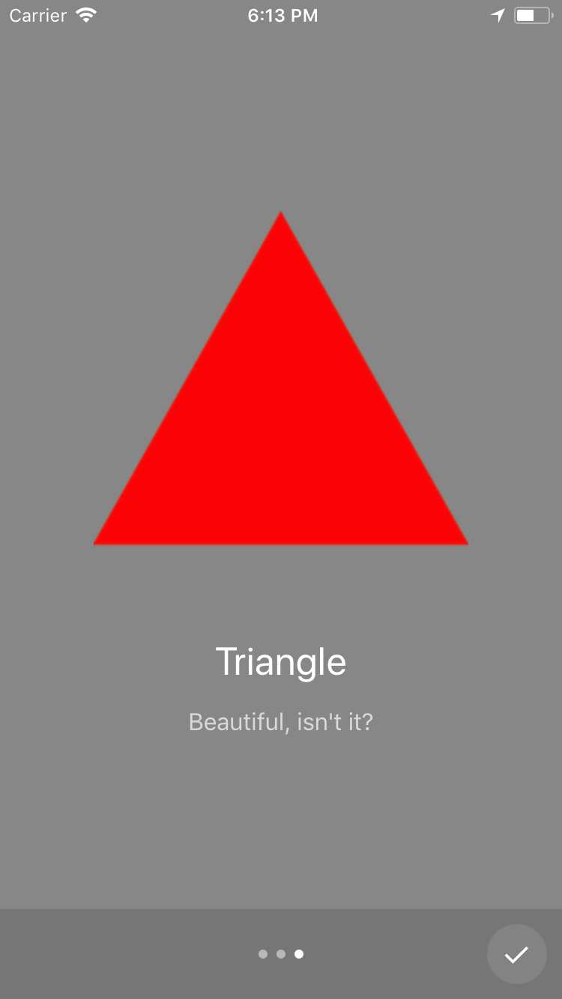

# `<Onboarding />` [](https://www.npmjs.com/package/react-native-onboarding-swiper) [](https://www.npmjs.com/package/react-native-onboarding-swiper)

|  |  |  |
| --------------------- | --------------------- | --------------------- |


There are many ways to onboard people to your mobile app. But for React-Native, there is solely _one_ component that is a) **easy to setup** and b) **highly customizable**: `react-native-onboarding-swiper`.

Your new users shouldn't jump in at the deep end. First give them a pleasurable, delightful introduction and only then let them explore your awesome app.

Getting everything running merely takes a minute. Don't believe me? Try it out!

## Install

```
npm i react-native-onboarding-swiper
```

```js
import Onboarding from 'react-native-onboarding-swiper';
```

## Usage

```js
<Onboarding
  pages={[
    {
      backgroundColor: '#fff',
      image: <Image source={require('./images/circle.png')} />,
      title: 'Onboarding',
      subtitle: 'Done with React Native Onboarding Swiper',
    },
    ...
  ]}
/>
```

## Examples

Try out the the example [running in your browser](https://snack.expo.io/rk80s-CDz).

Also check out the three examples files: the [simple example](examples/Simple.js), the [example with a Call-to-Action button](examples/WithCTA.js) or the [example with custom button components](examples/CustomButtons.js).

## Required Properties

* `pages` (required): an array of pages in the following shape:
  * `backgroundColor` (required): a background color. The color of the font and dots adapts to the background color.
  * `image` (required): a component (e.g. `<Image />`) to display at the top of the page.
  * `title` (required): a string **OR** a React-Native component.
  * `subtitle` (required): a string **OR** a React-Native component.

## Optional Properties

* `onSkip` (optional): a callback that is fired if the Onboarding is skipped.
* `onDone` (optional): a callback that is fired after the Onboarding is completed.
* `showSkip` (optional): a bool flag indicating whether the Skip button is visible. Defaults to `true`.
* `showNext` (optional): a bool flag indicating whether the Next button is visible. Defaults to `true`.
* `showDone` (optional): a bool flag indicating whether the Done checkmark button is visible. Defaults to `true`.
* `skipLabel` (optional): a string **OR** a React-Native component for the Skip label. Defaults to `Skip`.
* `nextLabel` (optional): a string **OR** a React-Native component for the Skip label. Defaults to `Next`.
* `bottomBarHeight` (optional): a number for the height of the bottom bar. Defaults to `60`.
* `bottomBarHighlight` (optional): a bool flag indicating whether the bottm bar should be highlighted. Defaults to `true`.
* `imageContainerStyles` (optional): for a page in the `pages` array, you can override the default styles e.g. the `paddingBottom` of 60.
* `controlStatusBar` (optional): a bool flag indicating whether the status bar should change with the background color. Defaults to `true`.
* `flatlistProps` (optional): additional props for the [FlatList](https://facebook.github.io/react-native/docs/flatlist.html) which holds all the pages.

## Custom Components Properties

You can also provide your own custom components for the buttons and the dots. All of them have access to a `isLight` prop but it's up to you what you do with it. Also checkout [this example](examples/CustomButtons.js).

* `SkipButtonComponent` (optional): Skip Button, gets `skipLabel` as prop.
* `NextButtonComponent` (optional): Next Button, gets `nextLabel` as prop.
* `DoneButtonComponent` (optional): Done Button.
* `DotComponent` (optional): Dot for the pagination, gets `selected` as prop to indicate the active page.

## Contributing

If you have a **question**, found a **bug** or want to propose a new **feature**, have a look at the [issues page](https://github.com/jfilter/react-native-onboarding-swiper/issues).

**Pull requests** are especially welcomed when they fix bugs or improve the code quality.

## Acknowledgements

Built upon the work by [Gosha Arinich](https://github.com/goshakkk/react-native-simple-onboarding) which was originally inspired by [AndroidOnboarder](https://github.com/chyrta/AndroidOnboarder).

## License

MIT.
